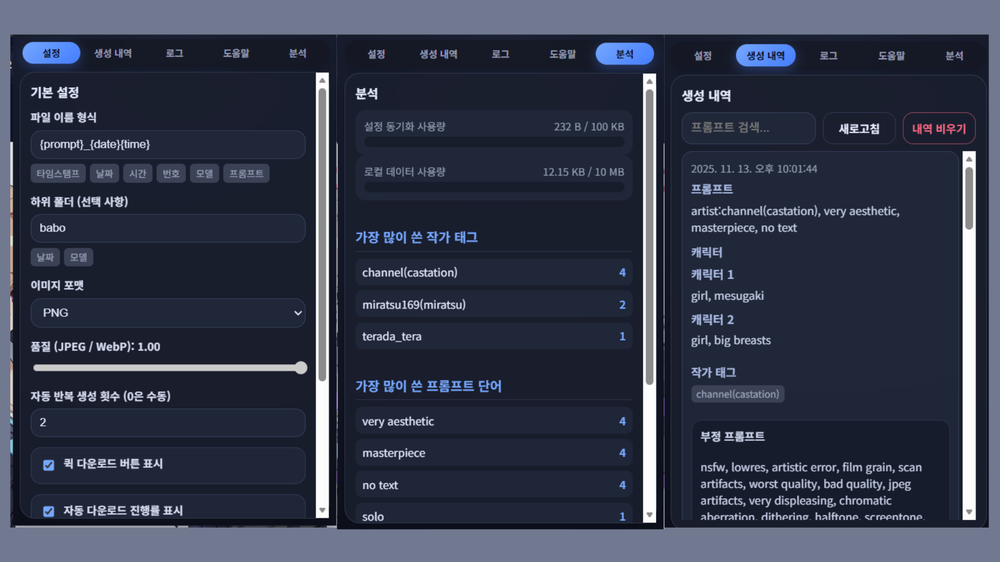

# NaiThiefRemover: NovelAI 이미지 안전 다운로더

NovelAI에서 이미지를 제작한 후, 다운로드를 받을 때 이미지 내부에 시드나 프롬프트 등등의 데이터가 같이 딸려오게 됩니다.

이러한 이미지를 온라인에 공유할 경우, 여러분이 제작한 이미지들의 프롬프트를 타인이 취득 후 사용할 수 있습니다.
이 확장 프로그램은, 이미지의 픽셀 데이터만 추출하여 다운로드 받게 해 주므로, 일일히 프롬프트 데이터를 제거해야 하는 수고를 덜어줍니다.

## 주요 기능

- **메타데이터 제거**: 이미지에서 EXIF, PNG 메타데이터(시드, 프롬프트 등)를 자동으로 제거하여 안전하게 다운로드
- **포맷 변환**: JPEG, WebP, PNG 형식으로 변환 가능하며, 품질 설정 지원
- **자동 다운로드**: 설정한 횟수만큼 자동으로 이미지 생성 및 다운로드를 반복 수행
- **파일명 커스터마이징**: 타임스탬프, 날짜, 모델명 등 다양한 키워드를 사용한 파일명 및 폴더 구조 설정
- **생성 내역 관리**: 다운로드한 이미지의 메타데이터를 저장하고 검색 가능
- **분석 기능**: 사용한 프롬프트 단어, 작가 태그, 모델 등의 통계 분석

## 사용 방법

1. 확장 프로그램을 설치한 후 NovelAI 페이지에서 이미지를 생성합니다.
2. 우측 상단에 나타나는 컨트롤 패널에서 수동 다운로드 버튼을 클릭하여 현재 보이는 이미지를 다운로드할 수 있습니다.
3. 자동 다운로드를 사용하려면 팝업에서 "자동 반복 생성 횟수"를 설정한 후, 컨트롤 패널의 자동 다운로드 버튼을 클릭합니다.
4. 파일명 형식과 하위 폴더 구조는 팝업의 "설정" 탭에서 커스터마이징할 수 있습니다.

## 자동 다운로드 주의사항

1000ms(1초)의 간격을 두고 자동으로 생성 -> 저장을 반복하여 수행해주는 기능도 포함되어 있습니다.
다만, 경우에 따라 NAI 규정에 따라 제재를 받을 수 있으며, 임의로 코드나 설정을 수정하여 이러한 지연 시간을 없애버리는 경우에도 제재를 받을 가능성이 존재한다는 것을 인지하신 후 사용하셔야 합니다.

## 파일명 키워드

다음 키워드를 파일명이나 폴더 경로에 사용할 수 있습니다:
- `{timestamp}`: 현재 시간의 타임스탬프
- `{date}`: 오늘 날짜 (예: 2025-11-13)
- `{time}`: 현재 시간 (예: 142030)
- `{index}`: 다운로드 순서 번호
- `{model}`: 이미지 생성에 사용된 모델 이름
- `{prompt}`: 프롬프트 내용의 일부 (최대 40자)
